# CPP Capstone Project : Luciole - An light intensity adaptor based on people position.

This is the project for the capstone project in the [Udacity C++ Nanodegree Program](https://www.udacity.com/course/c-plus-plus-nanodegree--nd213).

Luciole is C++-based software that is designed to adapt light intensity of sources located in a defined area regarding the instant position of the a person or group a person in motion into this area. This project provide the base-code for updating the light intensity of the hard-wired light grid set-up from the images retrieved from a camera connected to the computing system.

## Dependencies for Running Locally
* cmake == 3.14.4 -- version used locally for the project (other versions might be suitabe as well)
  * All OSes: [click here for installation instructions](https://cmake.org/install/)
* Microsoft Visual Studio (MSCV) == Community 2017
The version of Visual Studio is important as problem araised when creating the solution under Cmake  with open-cv library version. For having an up-and-ready environment without installation overhead it is recommanded use this [version](https://visualstudio.microsoft.com/fr/vs/older-downloads/) .
* Qt == 5.14.2 for MSVC_2017 

* Open-CV == 4.4.0

* make : not used locally for this project.
  * Linux: make is installed by default on most Linux distros
  * Mac: [install Xcode command line tools to get make](https://developer.apple.com/xcode/features/)
  * Windows: [Click here for installation instructions](http://gnuwin32.sourceforge.net/packages/make.htm)
* gcc/g++ : not used for compiling, Visual Studio used instead
  * Linux: gcc / g++ is installed by default on most Linux distros
  * Mac: same deal as make - [install Xcode command line tools](https://developer.apple.com/xcode/features/)
  * Windows: recommend using [MinGW](http://www.mingw.org/)

## Qt Installation instructions (Windows)
* Download and install Qt 
1. Download [Qt online installer](https://www.qt.io/download-qt-installer?hsCtaTracking=99d9dd4f-5681-48d2-b096-470725510d34%7C074ddad0-fdef-4e53-8aa8-5e8a876d6ab4)
2. Open the pop-up window and step-through the installation, sign-up in case of first use.
3. Choose Custom Installation to select the right packages to be installed
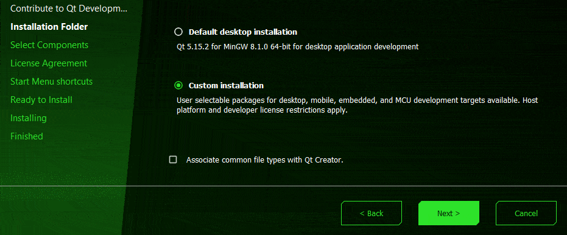
4. Select Qt 5.14.2 for the compiler of your choosing as well as the destination folder. For instance MSCV-2017 x64
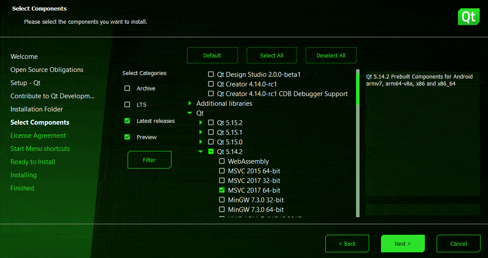
5. Click on Install

* Set up the environment variable to be recognized by Open CV
1. Go to system variable and set up the variables as follow, regarding where you previously installed the Qt libraries
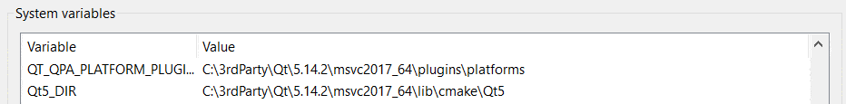

## Open-CV Installation instructions (Windows)
* Some general instruction websites are provided here 
[Build Open CV and Run Hello World](https://medium.com/@romualdorojo97/how-to-build-opencv-c-and-run-hello-world-example-2018-in-windows-63378fd16ab4)
[Build OpenCV with Cmake](https://cv-tricks.com/how-to/installation-of-opencv-4-1-0-in-windows-10-from-source/)
[link OpenCv libs with Cmake](https://stackoverflow.com/questions/13970377/configuring-an-c-opencv-project-with-cmake)

1. Download OpenCv source code [version 4.4.0](https://opencv.org/releases/) and place it under a dedicated local folder ( `C:/3rdParty/OpenCV/opencv-4.4.0/opencv-4.4.0` for instance)
2. Download OpenCV_contrib version 4.4.0 from [git](https://github.com/opencv/opencv_contrib/releases/tag/4.4.0)
This additionnal packages ensure the provisionning of more functionalities and handles for Openv-CV base library. Place it under a dedicated local folder (`C:\3rdParty\OpenCV\opencv_contrib-4.4.0` for instance)
3. Open Cmake (3.14.4 in our case) and fill up the OpenCV source code location previously set up as well as the where to build the outcoming binaries.
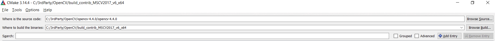
4. Click on configure and select options for build on the specific OS (x64 in our case)
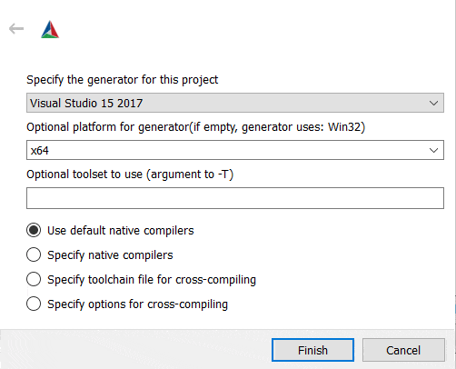
5. Once the configure is done fill up the extra_module_path with the path where the extra contrib packages was installed.    

6. Click the WITH_OPENGL and WITH_QT options. Those are used by OpenCV for all kinds of displays.
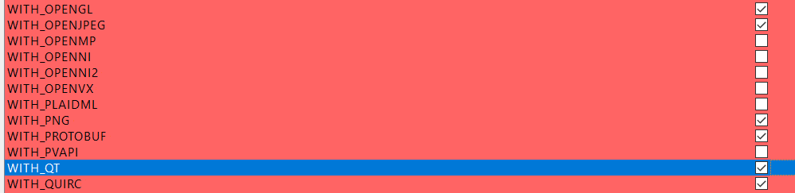
7. Click on Configure again. One can check that thepath to the Qt libs are set up correctly under to the place we have extracted them already.
8. Click on Configure again (until no red stripes are displayed)
9. Click on Generate. This step will generate all the binaries in the indicated folder. To show to solution click on Open Solution (if MSCV was defined as compiler then it will open the solution under MSCV). Check that the Platform is correctly set (x64 in our case).
10. On MSCV, go to solution explorer, right click on the ALL_BUILD project and click on "build". Wait until the build is successfull.
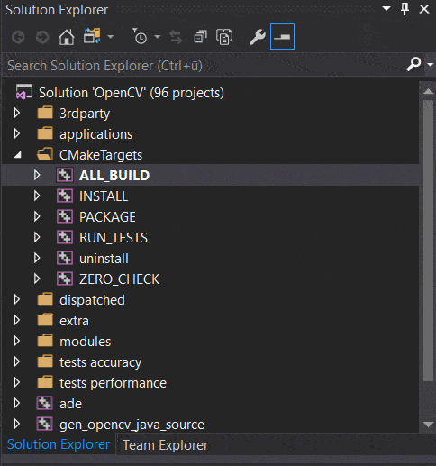
11. Right click on INSTALL and then build to complete the generation of binaries.

Note : If the debug mode is selected then the binaries will be build for debug only. For release select the release options and start over through the above steps again.

## Basic Build Instructions
The compiler used is MSCV but other compilers of your choosing are also permitted.

1. Clone the repo
2. Double click on the compile batch file. This will create the project MSCV solution for which the compiling and build can be executed.
3. In case some libraries are not found, create a `Debug` folder at the same level than the extracted repo sources and copy all the debug binaries from the OpenCV binaries output folder (.dll) in the debug folder. Compile again.
`C:\3rdParty\OpenCV\build_contrib_MSCV2017_v6_x64\bin\Debug` to `C:\projectlocation\Debug`
4. Same for Qt libraries if needed 
`C:\3rdParty\Qt\5.14.2\msvc2017_64\bin` and other locations to `C:\projectlocation\Debug`
5. Open DisplayImage.sln, build solution.
The same applies for the release binaries respectively. 
6. Run it: go to Debug folder: `./DisplayImage.exe` (or fire-up directly from the window debugger of Visual Studio)

## Hardware set-up
The code is pushed onto a raspberry which is connected to a camera hanging on the ceiling of the room as well as wired to all light sources in the room. The camera detect the movement of the person and adapt the light intensity with the most shining light being the closest to the person given a certain frame.

## Scenario
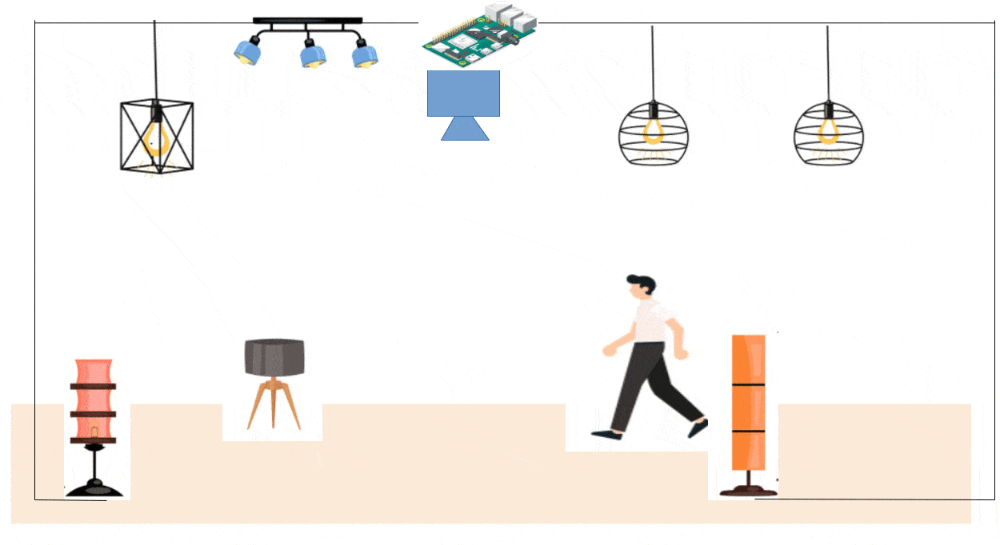
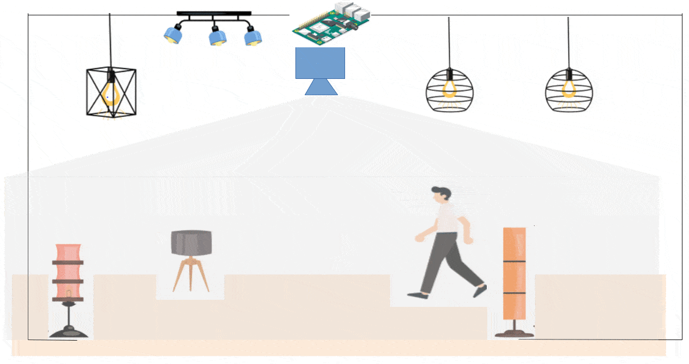
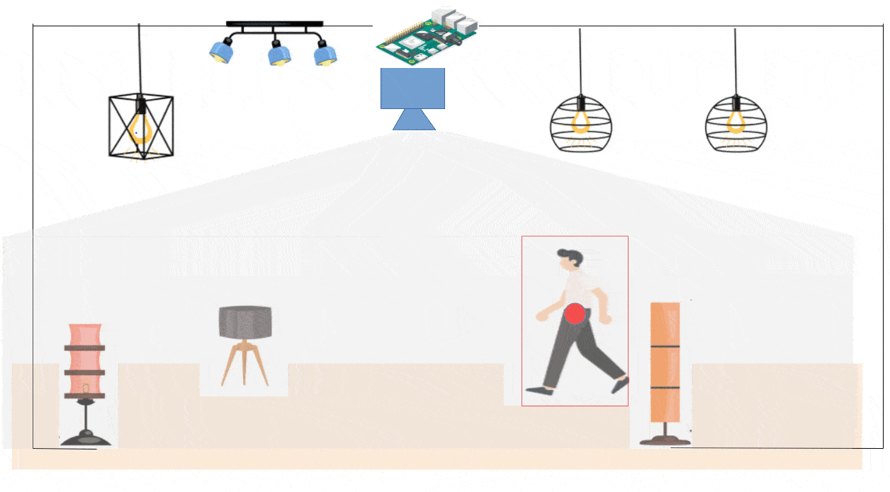
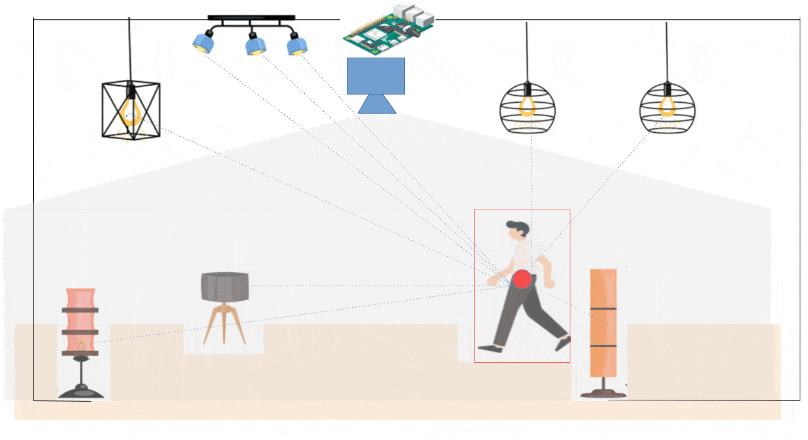
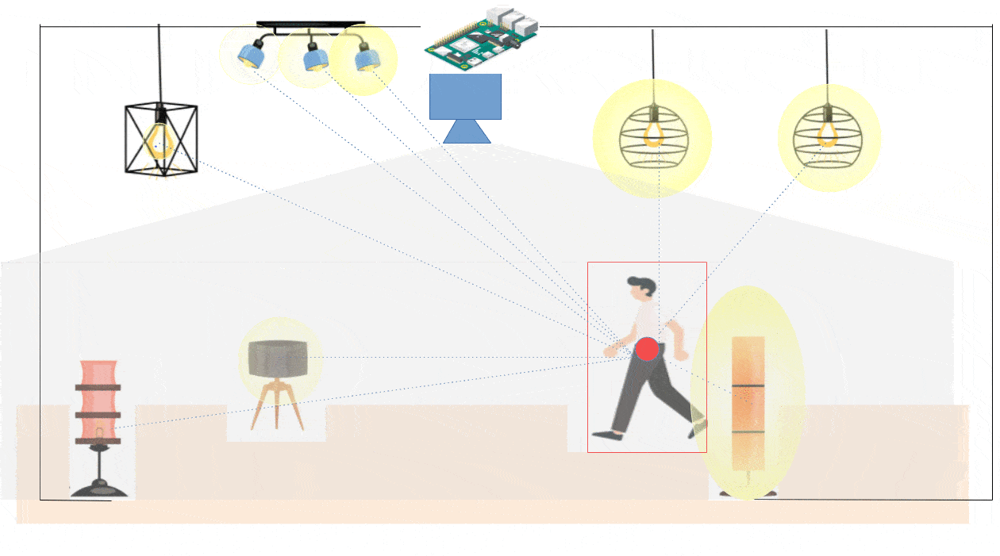
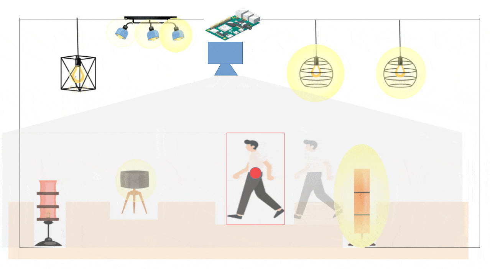
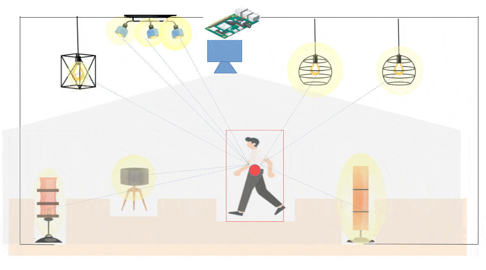

1. Light source Initialization

The lights sources are lighted up one by one so that the camera can detect them and set their position regarding where they appear on the picture.

2. Detect Persons motions

The software is able to detect a moving instance, in the best case a person and track his motion within the field of the camera. The camera has therefore frame by frame the position in term of its barycentre of the persons in the room.

3. Update Light Intensity

Based on the position of the persons in the room, the software update the light intensity accordingly, with the rules that the farthest lights are shining less. The aim is to have some sort a choregraphy between the person moving and the lights intensities.

## Configure software

From a pratical point of view, at the current standpoint no connection is made to any hardware. This means that the camera records is mocked by a video of a ball moving in the real case, and the light sources are mocked to a simple display onto the resulting images. These are the dots rendered, with the intensity being embodied with the diameter and the brightness of those disks. 

The sofware needs some parameters to be set-up. It is not recommanded to play.around to much with those are they are already tricked to cover a simple case application:
* Ball moving in case of a real scene
* Square representing a moving instance in case of a mock scenario

One parameter can be changed, for better understanding : `mockScenario = true`. This is a boolean telling whether the programm should process the real scenario of the mock scenario. Please change this parameter as you wish. The configuration is hold in a class called `Config`

